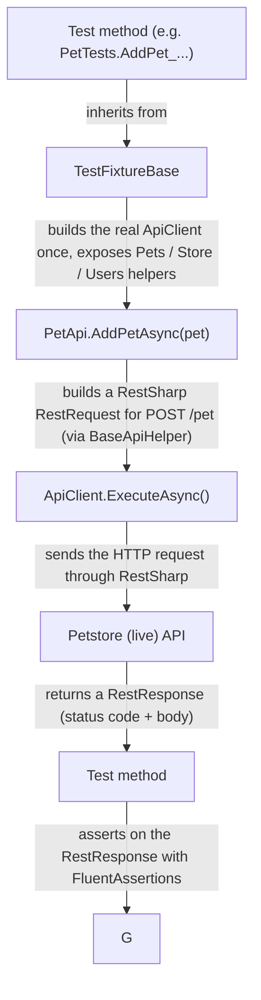

# Petstore RestSharp POC


A C# API automation (testing) framework for the public [Petstore Swagger API](https://petstore.swagger.io/),
built with **RestSharp**, **NUnit** and **FluentAssertions**.

This repository is a **proof of concept (POC)**: it shows a small, readable way to build an
HTTP API test suite in C# and is intended as a learning reference.

---

## Index

1. [Overview](#overview)
2. [Technology stack](#technology-stack)
3. [Prerequisites](#prerequisites)
4. [Getting started](#getting-started)
   - [Clone the repository](#clone-the-repository)
   - [Restore packages](#restore-packages)
   - [Build the solution](#build-the-solution)
   - [Run the tests](#run-the-tests)
5. [How the framework works (request flow)](#how-the-framework-works-request-flow)
6. [Project structure](#project-structure)
7. [Configuration](#configuration)
8. [Test walkthrough](#test-walkthrough)
9. [Design principles](#design-principles)
10. [Troubleshooting & common issues](#troubleshooting--common-issues)
11. [Notes & known quirks](#notes--known-quirks)
12. [Reporting](#reporting)
13. [Learning resources](#learning-resources)

---

## Overview

The project automates tests against the **live** Petstore demo API
(`https://petstore.swagger.io/v2`). It does not mock the server — every test makes a real
HTTP request over the internet, which means **an internet connection is required**.

The tests cover the three main areas of the Petstore API:

| Resource | What it models | Example endpoints covered |
| -------- | -------------- | ------------------------- |
| `/pet`   | Pets in a store (`Pet` model) | add, get by id/status/tags, update (JSON + form), upload image, delete |
| `/store` | Shop orders (`Order` model) | inventory, place/get/delete order |
| `/user`  | Registered users (`User` model) | create (single, list, array), login/logout, get by username, update, delete |

> Every operation in the Petstore Swagger spec (`POST/PUT/GET/DELETE` on all `/pet`,
> `/store` and `/user` resources) has at least one test. Coverage is 100% of the
> documented workflows.

### What each library does

- **RestSharp** — the HTTP client used to send requests and receive responses. It wraps
  `HttpClient` and gives a friendly builder API for URL segments, query parameters, JSON
  bodies, etc.
- **NUnit** — the test framework. It provides the attributes that turn C# methods into tests
  (`[Test]`, `[TestCase]`, `[TestFixture]`) and the test runner that `dotnet test` uses.
- **FluentAssertions** — a library that replaces plain `Assert.AreEqual(...)` checks with
  readable, sentence-like assertions such as `pets.Should().NotBeEmpty(...)`, which produce
  much better failure messages.

---

## Technology stack

| Component | Version | Role |
| --------- | ------- | ---- |
| .NET SDK | 10 | Runtime and build tooling |
| RestSharp | 114 | HTTP client for calling the API |
| NUnit | 4 | Test framework and runner |
| FluentAssertions | 8 | Assertion library for readable checks |
| ExtentReports | 5 | HTML test reporting and logging |

---

## Prerequisites

- **.NET 10 SDK** (or newer) installed on your machine.
  - Verify with: `dotnet --version`
  - Download it from https://dotnet.microsoft.com/download (the "SDK" bundle, not just the runtime).
- **Internet access** — the tests hit the live Petstore sandbox.
- *(Optional but recommended)* An IDE or editor: Visual Studio, JetBrains Rider, or VS Code
  with the C# extension.

> Apart from the SDK, **nothing needs to be installed**. NuGet packages (RestSharp, NUnit,
> FluentAssertions, ...) are restored automatically the first time you build.

---

## Getting started

### Clone the repository

```bash
git clone https://github.com/matiasmagni/petstore-restsharp-poc.git
cd petstore-restsharp-poc
```

### Restore packages

Downloads all NuGet dependencies referenced in the `.csproj` files:

```bash
dotnet restore
```

This is usually done automatically by `dotnet build`, but running it explicitly is a good
way to check that the packages resolve before compiling.

### Build the solution

```bash
dotnet build
```

`dotnet build` looks for the solution file (`PetstoreRestsharp.slnx`) in the current
directory and compiles both projects in it:

- `src/PetstoreRestsharp.Core` — the reusable framework (no test-framework coupling).
- `tests/PetstoreRestsharp.Tests` — the actual NUnit tests.

### Run the tests

```bash
dotnet test
```

Test results are printed to the console. You can filter specific tests:

```bash
# only Pet tests
dotnet test --filter "FullyQualifiedName~PetTests"

# only a specific test by name
dotnet test --filter "Name~AddPet"
```

---

## How the framework works (request flow)

Reading a test from top to bottom, this is what happens:



Walk through of the pieces, from the inside out:

1. **`TestFixtureBase`** (`tests/.../TestFixtureBase.cs`)
   Every test class extends it. It constructs a single `ApiClient` (configured from
   `TestSettings`) and instantiates one helper per API resource: `Pets`, `Store`, `Users`.
   Because NUnit creates a **new instance of the test class per test**, each test gets a
   fresh HTTP client — keeping tests independent of each other.

2. **`TestSettings`** (`src/.../Configuration/TestSettings.cs`)
   An immutable settings object built once from environment variables, falling back to
   sensible defaults. It decides the `BaseUrl` and HTTP `TimeoutSeconds` used everywhere.

3. **`ApiClient`** (`src/.../Clients/ApiClient.cs`)
   A thin wrapper around RestSharp's `RestClient`. It centralizes the base URL and timeout
   so the whole suite shares the same HTTP configuration (**DRY**).

4. **`IApiClient`** (`src/.../Clients/IApiClient.cs`)
   An interface that abstracts the HTTP call (`ExecuteAsync`). Tests and helpers depend on
   the interface rather than the concrete client, which would allow swapping in a fake
   implementation for unit tests (**SOLID — D**).

5. **`BaseApiHelper`** (`src/.../Api/BaseApiHelper.cs`)
   Base class that provides shared plumbing for building requests and executing them.
   Resource-specific classes (`PetApi`, `StoreApi`, `UserApi`) only write their own
   endpoint logic — DRY and **Single Responsibility**.

6. **`PetApi` / `StoreApi` / `UserApi`** (`src/.../Api/`)
   One class per API resource. Each method maps to one HTTP endpoint, e.g.
   `PetApi.GetByIdAsync(id)` → `GET /pet/{id}`.

7. **Models** (`src/.../Models/`)
   Plain C# classes (`Pet`, `Store`, `User`, `Category`, `Tag`) that mirror the JSON shape
   of the API. They are the types you serialize to and deserialize from.

8. **`Json`** (`src/.../Json.cs`) and **`RestResponseExtensions`**
   A single, central JSON configuration (camelCase, enums as strings, lenient dates) and
   helpers to safely deserialize response bodies (**DRY**).

9. **`RestResponseAssertions`** (`tests/.../Assertions/`)
   Custom FluentAssertions that understand `RestResponse`, offering readable assertions like
   `.Should().BeSuccessful()` and `.Should().DeserializeAs<Pet>().Which`.

---

## Project structure

```
petstore-restsharp-poc/
│
├── PetstoreRestsharp.slnx          # solution file: groups the projects below
├── README.md                       # this file
│
├── src/                            # ---- FRAMEWORK (reusable, no test dependency) ----
│   └── PetstoreRestsharp.Core/
│       ├── PetstoreRestsharp.Core.csproj     # project file; references RestSharp only
│       ├── Api/                     # one helper class per API resource
│       │   ├── BaseApiHelper.cs     #   shared request/execute plumbing
│       │   ├── PetApi.cs            #   every /pet endpoint
│       │   ├── StoreApi.cs          #   every /store endpoint
│       │   └── UserApi.cs           #   every /user endpoint
│       ├── Clients/
│       │   ├── IApiClient.cs        # abstraction over the HTTP call
│       │   └── ApiClient.cs         # RestSharp RestClient wrapper (base URL + timeout)
│       ├── Configuration/
│       │   └── TestSettings.cs      # env-var driven, immutable settings
│       ├── Extensions/
│       │   └── RestResponseExtensions.cs  # helpers to read response content
│       ├── Models/                  # C# classes mirroring the API's JSON
│       │   ├── Pet.cs               #   Pet + PetStatus enum
│       │   ├── Order.cs
│       │   ├── User.cs
│       │   ├── Category.cs
│       │   └── Tag.cs
│       ├── Json.cs                  # central JSON serialization settings
│       └── LenientDateTimeConverter.cs   # tolerant date parsing (see Notes)
│
└── tests/                          # ---- TESTS (test-framework coupled) ----
    └── PetstoreRestsharp.Tests/
        ├── PetstoreRestsharp.Tests.csproj  # project file; references NUnit, FluentAssertions, Core
        ├── GlobalUsings.cs         # global `using` for the custom assertions
        ├── TestFixtureBase.cs      # shared test setup (builds clients/helpers)
        ├── Assertions/
        │   └── RestResponseAssertions.cs   # custom FluentAssertions for RestResponse
        ├── TestData/
        │   └── PetTestData.cs      # factories that build test objects
        ├── PetTests.cs             # tests for /pet endpoints
        ├── StoreTests.cs           # tests for /store endpoints
        └── UserTests.cs            # tests for /user endpoints
```

> The `src/` (Core) project deliberately does **not** reference NUnit or FluentAssertions.
> Keeping the framework free of test-framework dependencies means it could be reused with a
> different test framework later, and keeps responsibilities cleanly separated.

---

## Configuration

The framework stays light by reading settings from **environment variables**, with defaults.
Nothing else is required to run the suite.

| Variable | Default | Purpose |
| -------- | ------- | ------- |
| `PETSTORE_BASE_URL` | `https://petstore.swagger.io/v2` | Base URL of the API under test |
| `PETSTORE_TIMEOUT_SECONDS` | `30` | HTTP client timeout, in seconds |

Examples of overriding on the command line:

```bash
# Linux / macOS
PETSTORE_BASE_URL=http://localhost:8080/v2 dotnet test

# PowerShell (Windows)
$env:PETSTORE_BASE_URL = "http://localhost:8080/v2"; dotnet test
```

This makes it easy to point the same tests at a local, disposable instance of the Petstore
server (e.g. a Dockerized one) without touching any code.

---

## Test walkthrough

Let's dissect one test to see how the pieces fit together. From `PetTests.cs`:

```csharp
[Test]
public async Task AddPet_WithValidPet_Returns200AndPersists()
{
    // Arrange
    var pet = PetTestData.CreatePet(id: UniqueIdLong(), name: "Buddy", status: "available");

    // Act
    var response = await Pets.AddPetAsync(pet);

    // Assert
    response.Should().BeSuccessful("the API should accept a well-formed pet");
    response.StatusCode.Should().Be(HttpStatusCode.OK);

    var created = await Pets.GetByIdAsync(pet.Id);
    created.Should().BeSuccessful();
    var fetched = created.Should().DeserializeAs<Pet>().Which;
    fetched.Name.Should().Be("Buddy");
    fetched.Status.Should().Be("available");

    // Cleanup
    await Pets.DeleteAsync(pet.Id);
}
```

Line by line:

1. **`[Test]`** — the NUnit attribute that marks this method as a test. The runner discovers
   and executes it.

2. **`public async Task`** — the test calls an HTTP API, so it is asynchronous and is awaited.

3. **`// Arrange`** — builds the input data. `PetTestData.CreatePet(...)` (a factory in
   `tests/.../TestData/PetTestData.cs`) returns a fully-formed `Pet` object, keeping the
   test focused on behavior instead of object construction.

4. **`// Act`** — performs the HTTP request. `Pets.AddPetAsync(pet)` sends `POST /pet` with
   the pet serialized as a JSON body and returns a `RestResponse`.

5. **`// Assert`** — verifies the outcome:
   - `response.Should().BeSuccessful()` — custom FluentAssertions; passes only for 2xx codes.
   - `response.Should().DeserializeAs<Pet>().Which` — asserts there is a body, deserializes
     it to a `Pet`, and hands it back for further property checks.
   - `fetched.Name.Should().Be("Buddy")` — classic FluentAssertions equality check.

6. **`// Cleanup`** — deletes the created pet so the test does not leave garbage on the
   shared sandbox and does not affect other tests.

This **Arrange / Act / Assert (AAA)** structure is used consistently across all tests.

---

## Design principles

The acronyms used in the code comments, explained:

- **SOLID** — five object-oriented design principles.
  - *S — Single Responsibility:* each API helper (`PetApi`, `StoreApi`, ...) only knows its
    own resource. One reason to change.
  - *O / L / I* — the code keeps things open, substitutable and segregated via the
    `IApiClient` interface.
  - *D — Dependency Inversion:* helpers depend on the `IApiClient` abstraction, not on the
    concrete `ApiClient`, so they could be tested with a fake.

- **KISS** — "Keep It Simple, Stupid". No over-engineered dependency-injection containers or
  configuration frameworks. Environment variables with defaults are enough.

- **DRY** — "Don't Repeat Yourself". Repeating logic (JSON settings, status/deserialization
  checks, request plumbing) lives in one place and is reused.

- **AAA** — every test is explicitly split into `// Arrange`, `// Act` and `// Assert`.

- **DDT** — "Data-Driven Testing". One test method runs many times with different data using
  NUnit attributes:

  ```csharp
  [TestCase("available")]
  [TestCase("pending")]
  [TestCase("sold")]
  public async Task FindByStatus_ForEachStatus_Returns200WithNonEmptyList(string status)
  ```

  Each `[TestCase(...)]` produces a separate test run in the report.

---

## Troubleshooting & common issues

| Symptom | Likely cause | Fix |
| ------- | ------------ | --- |
| `dotnet` is not recognized as a command | .NET SDK is not installed, or not on `PATH` | Install the .NET 10 SDK and reopen your terminal |
| Tests fail with connection/timeout errors | No internet access, or the Petstore sandbox is slow/down | Check connectivity; retry; raise `PETSTORE_TIMEOUT_SECONDS` |
| `dotnet build` reports the target framework isn't available | Installed SDK is older than .NET 10 | Install/update to the .NET 10 SDK |
| A test that should pass is flaky | The shared live sandbox was modified by other users or a prior failed run left data behind | The Ids are random (`UniqueIdLong`) to avoid collisions; run the suite again |
| System.Text.Json date errors in your own experiments | The Petstore date format is non-standard | Use the framework's `LenientDateTimeConverter` / central `Json.Options` instead of a fresh `JsonSerializerOptions` |

---

## Notes & known quirks

- The Petstore demo serializes dates like `2023-12-06T10:43:14.823+0000`, which the strict
  System.Text.Json ISO-8601 parser rejects. A `LenientDateTimeConverter` in the core handles
  this while keeping a single JSON-configuration point.
- Tests run against a **shared, live, third-party sandbox**. The server can return
  `503`/timeouts or behave inconsistently under load; data created by other users can cause
  an occasional non-deterministic result.
- This is a POC, so it intentionally favors simplicity over production-scale engineering
  (e.g. one file per resource, no logging layer, no CI pipeline).

---

## Reporting

This project uses **ExtentReports** to generate rich HTML test reports. After running the tests, an HTML report is created in the test output directory.

### How to View the Report

1. Run the tests:
   ```bash
   dotnet test
   ```
2. Navigate to the test output directory (typically `tests/PetstoreRestsharp.Tests/bin/Debug/net10.0/`).
3. Open `TestReport.html` in your web browser.

The report provides a detailed overview of the test execution, including:
- Pass/Fail/Skip status for each test.
- Execution time.
- Detailed logs added during the test steps (e.g., request parameters, response codes).
- System information.

### Implementation Details

- **Initialization**: `TestFixtureBase.cs` initializes the `ExtentReports` instance and the HTML reporter in a static constructor (runs once per test session).
- **Lifecycle**: 
  - `[SetUp]` creates a new `ExtentTest` for each test method.
  - `[TearDown]` logs the test result (Pass/Fail/Skip) and flushes the report to disk.
- **Logging**: Test methods use `Test.Log(...)` to record specific steps and observations.

---

## Learning resources

- **RestSharp**: https://restsharp.dev — the HTTP client used here.
- **NUnit**: https://docs.nunit.org — attributes, assertions and the test runner.
- **FluentAssertions**: https://fluentassertions.com — readable assertion syntax.
- **Petstore Swagger spec**: https://petstore.swagger.io — the API under test (you can browse
  the endpoints in your browser).
- **.NET SDK downloads**: https://dotnet.microsoft.com/download